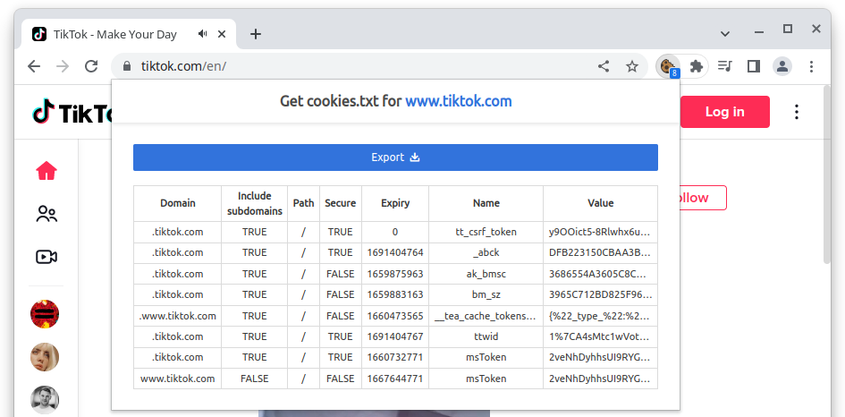

<!-- README.md is generated from README.Rmd. Please edit that file -->

```{r, include = FALSE}
knitr::opts_chunk$set(
  collapse = TRUE,
  comment = "#>",
  fig.path = "man/figures/README-",
  out.width = "100%"
)
```

# traktok

<!-- badges: start -->
[](https://lifecycle.r-lib.org/articles/stages.html#experimental)
[](https://github.com/JBGruber/traktok/actions/workflows/R-CMD-check.yaml)
[](https://codecov.io/gh/JBGruber/traktok?branch=main)
[](https://twitter.com/JohannesBGruber)
<!-- badges: end -->


The goal of traktok is to provide easy access to TikTok data. This package is an R port of Deen Freelon's [Pyktok](https://github.com/dfreelon/pyktok) Python module. It can

 - [Download TikTok videos](#videos)
 - [Download video metadata](#videos)
 - [Download all available video comments](#comments)
 - [Download up to 30 most recent user video URLs](#user-accounts)
 - [Download full TikTok JSON data objects (in case you want to extract data from parts of the object not included in the above functions)](#json-data)
 
The same disclaimer as for Pyktok applies: 

> This program may stop working suddenly if TikTok changes how it stores its data ([see Freelon, 2018](https://osf.io/preprints/socarxiv/56f4q/)).

I check automatically every day if the approach is still working. Current status: [](https://github.com/JBGruber/traktok/actions/workflows/still-working.yaml)

## Installation

You can install the development version of traktok from [GitHub](https://github.com/) with:

``` r
# install.packages("remotes")
remotes::install_github("JBGruber/traktok")
```

## Usage

### Authentication

Pyktok uses the module [browser_cookie3](https://github.com/borisbabic/browser_cookie3) to directly access the cookies saved in your browser. Such an infrastructure does not exists, to my knowledge, in `R`.
Instead, you can export the necessary cookies from your browser using a browser extension (after visiting TikTok.com at least once).
I can recommend ["Get cookies.txt"](https://chrome.google.com/webstore/detail/get-cookiestxt/bgaddhkoddajcdgocldbbfleckgcbcid) for Chromium based browsers or ["cookies.txt"](https://addons.mozilla.org/en-US/firefox/addon/cookies-txt/) for Firefox.



Once you've saved this file, you can either provide the path to it in every function, save it in your working directory or set the respective option like this:

```{r, eval=FALSE}
options(cookiefile = "path/to/tiktok.com_cookies.txt")
```

To TikTok, this will make it look as if `traktok` requests come from your ordinary browser.
If you experience issues, you can try to repeat these steps to get a fresh cookie file.

### Videos

You can get data from videos like this:

```{r VideoExample}
library(traktok)
example_urls <- c(
  "https://www.tiktok.com/@tiktok/video/6584647400055377158?is_copy_url=1&is_from_webapp=v1",
  "https://www.tiktok.com/@tiktok/video/6584647400055377158?is_copy_url=1&is_from_webapp=v1"
)
tt_videos(example_urls, save_video = FALSE)
```

You can download the videos by either setting `save_video` to `TRUE` or by exporting the URLs and downloading them with an external tool.

### Comments

```{r CommentsExample}
tt_comments(example_urls, max_comments = 50L)
```

### User accounts

```{r AccountsExample}
tt_user_videos("https://www.tiktok.com/@tiktok")
```

### Json data

```{r JsonExample, eval=FALSE}
video_json <- tt_json("https://www.tiktok.com/@tiktok/video/7106594312292453675?is_copy_url=1&is_from_webapp=v1")
user_json <- tt_json("https://www.tiktok.com/@tiktok")
```

