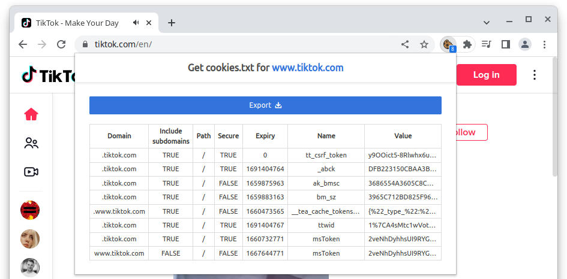
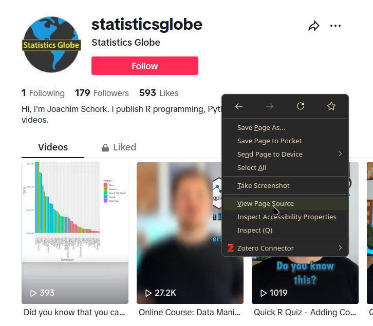
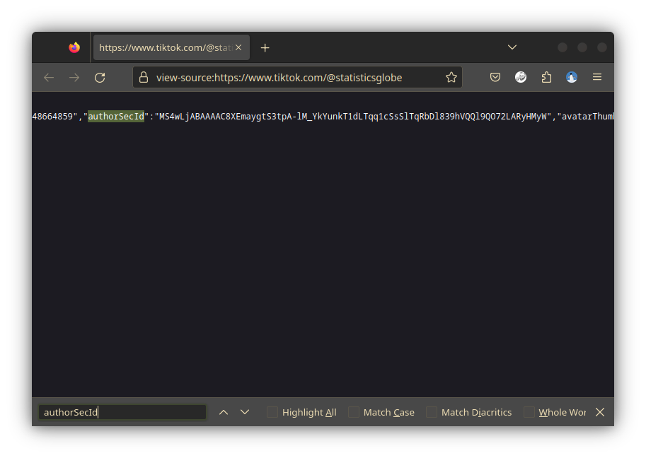

The unofficial or hidden API is essentially what the TikTok website uses to display you content.
Partly based on [Deen Freelon's `Pyktok` Python module](https://github.com/dfreelon/pyktok), `traktok` contains functions to simulate a browser accessing some of these API endpoints.
How these endpoints work was discovered through reverse engineering and TikTok might change how these endpoints operate at any moment.
As of writing this (2023-11-28), there are functions that can:

- search videos using a search term
- get video details and the video files from a given video URL
- get who follows a user
- get who a user is following

To use these functions, you have to log into <tiktok.com> first and then give `R` the cookies the browser uses to identify itself.


# Authentication

The easiest way to get the cookies needed for authentication is to export the necessary cookies from your browser using a browser extension (after logging in at TikTok.com at least once).
I can recommend ["Get cookies.txt"](https://chrome.google.com/webstore/detail/get-cookiestxt-locally/cclelndahbckbenkjhflpdbgdldlbecc) for Chromium based browsers or ["cookies.txt"](https://addons.mozilla.org/en-US/firefox/addon/cookies-txt/) for Firefox (note that almost all browsers used today are based on one of these).



Save the cookies.txt file, which will look something like this:

```
# Netscape HTTP Cookie File
# https://curl.haxx.se/rfc/cookie_spec.html
# This is a generated file! Do not edit.

.tiktok.com	TRUE	/	TRUE	1728810805	cookie-consent	{%22ga%22:true%2C%22af%...
.tiktok.com	TRUE	/	TRUE	1700471788	passport_csrf_token	e07d3487c11ce5258a3...
.tiktok.com	TRUE	/	FALSE	1700471788	passport_csrf_token_default	e07d3487c11...
#HttpOnly_.tiktok.com	TRUE	/	TRUE	1700493610	multi_sids	71573310862246389...
#HttpOnly_.tiktok.com	TRUE	/	TRUE	1700493610	cmpl_token	AgQQAPORF-RO0rNtH...
...
```

**It does not matter if you download all cookies or just the ones specific to TikTok**, as we use the `cookiemonster` package to deal with that.
To read the cookies into a specific encrypted file, simply use:


```r
cookiemonster::add_cookies("tiktok.com_cookies.txt")
✔ Cookies for tiktok.com, www.tiktok.com put in the jar!
```

And that's it!
`traktok` will access these cookies whenever neccesary.


# Usage
## Search videos

To search for videos, you can use either `tt_search` or `tt_search_hidden`, which do the same, as long as you do not have a token for the Research API.
To get the first two pages of search results (one page has 12 videos), you can use this command:


```r
rstats_df <- tt_search_hidden("#rstats", max_pages = 2)
#> 
ℹ Getting page 1

⏲ waiting 1.7 seconds

                      
ℹ Getting page 1

✔ Got page 1. Found 12 videos. [3.1s]
#> 
ℹ Getting page 2

✔ Got page 2. Found 12 videos. [706ms]
rstats_df
#> # A tibble: 24 × 20
#>    video_id           video_timestamp     video_url video_length video_title
#>    <chr>              <dttm>              <glue>           <int> <chr>      
#>  1 71151144193145602… 2022-06-30 19:17:53 https://…          135 "R for Beg…
#>  2 72522261538285847… 2023-07-05 07:01:45 https://…           36 "Wow!!! TH…
#>  3 72134135989980562… 2023-03-22 16:49:12 https://…            6 "R and me …
#>  4 72420686804844085… 2023-06-07 22:05:16 https://…           34 "R GRAPHIC…
#>  5 72576898902452011… 2023-07-20 00:23:40 https://…           56 "Pie chart…
#>  6 72999870594170422… 2023-11-10 23:58:21 https://…           51 "Quick R Q…
#>  7 72783048979114918… 2023-09-13 13:40:21 https://…           36 "Quick R Q…
#>  8 73029706679079928… 2023-11-19 00:56:09 https://…          163 "What is c…
#>  9 71670108637846930… 2022-11-17 15:42:56 https://…           58 "Here’s an…
#> 10 72933174570354312… 2023-10-24 00:36:48 https://…            9 "#CapCut #…
#> # ℹ 14 more rows
#> # ℹ 15 more variables: video_diggcount <int>, video_sharecount <int>,
#> #   video_commentcount <int>, video_playcount <int>, video_is_ad <lgl>,
#> #   author_name <chr>, author_nickname <chr>, author_followercount <int>,
#> #   author_followingcount <int>, author_heartcount <int>,
#> #   author_videocount <int>, author_diggcount <int>, music <list>,
#> #   challenges <list>, download_url <chr>
```

This already gives you pretty much all information you could want about the videos that were found.

## Get metadata and download videos

However, you can obtain some more information, and importantly the video file, using `tt_videos`:


```r
rstats_df2 <- tt_videos(rstats_df$video_url[1:2], save_video = TRUE)
#> Error in dir.create(cache_dir, showWarnings = FALSE): invalid 'path' argument
rstats_df2
#> Error in eval(expr, envir, enclos): object 'rstats_df2' not found
```

Per default, the function waits between one and ten seconds (chosen at random) between making two calls, to not make it too obvious that data is scraped from TikTok.
You can speed up the process (at your own risk), by changing the `sleep_pool` argument, which controls the minimum and maximum number of seconds to wait:


```r
rstats_df3 <- tt_videos(rstats_df$video_url[3:4], save_video = TRUE, sleep_pool = 0.1)
#> Error in dir.create(cache_dir, showWarnings = FALSE): invalid 'path' argument
rstats_df3
#> Error in eval(expr, envir, enclos): object 'rstats_df3' not found
```

When you are scraping a lot of URLs, the function might fail eventually, due to a poor connection or because TikTok is blocking your requests.
It therefore usually makes sense to save your progress in a cache directory:


```r
rstats_df3 <- tt_videos(rstats_df$video_url[5:6], cache_dir = "rstats")
#> 
ℹ Getting video 7257689890245201153

⏲ waiting 6.7 seconds              

                      
ℹ Getting video 7257689890245201153

✔ Got video 7257689890245201153 (1/2). File size: 1.7 Mb. [10.5s]
#> 
ℹ Getting video 7299987059417042209

✔ Got video 7299987059417042209 (2/2). File size: 1.2 Mb. [2.4s]
list.files("rstats")
#> [1] "7257689890245201153.json" "7299987059417042209.json"
```

Note that the video files are downloaded into the `dir` directory (your working directory by default), independently from your cache directory.

If there are information that you feel are missing from the `data.frame` `tt_videos` returns, you can look at the raw, unparsed json data using:


```r
rstats_list1 <- tt_request_hidden(rstats_df$video_url[1]) |>
  jsonlite::fromJSON()
```

Parsing the result into a list using `fromJSON`, results in a rather complex nested list.
You can look through this and see for yourself if the data you are interested in is there

## Get followers and who a user is following

Getting followers and who a user is following is (at the moment?) a little tricky to use, since TikTok blocks requests to a users profile page with anti-scraping measures.
To circumvent that, you can open a users page in your browser and then right-click to show the source code:^[
You can of course also use tools like [Playwright](https://playwright.dev/), [Selenium](https://www.selenium.dev/), or [](https://pptr.dev/) to automate this process.
But that is beyond the scope of this vignette and package.
]




You can then search for and copy the `authorSecId` value:



Once you have this `authorSecId` you can look up a maximum of 5,000 followers per account:


```r
tt_get_follower(secuid = "MS4wLjABAAAAwiH32UMb5RenqEN7duyfLIeGQgSIx9WtgtOILt55q6ueUXgz4gHqZC5HFx4nabPi")
#> 
ℹ Getting followers...

⏲ waiting 1 seconds   

                    
ℹ Getting followers...

✔ Got 198 followers. [2s]
#> 
ℹ Getting more followers...

⏲ waiting 0.4 seconds      

                      
ℹ Getting more followers...

✔ Got 396 followers. [1.4s]
#> 
ℹ Getting more followers...

⏲ waiting 7.3 seconds      

                      
ℹ Getting more followers...

✔ Got 593 followers. [8.4s]
#> 
ℹ Getting more followers...

⏲ waiting 3.5 seconds      

                      
ℹ Getting more followers...

✔ Got 789 followers. [4.5s]
#> 
ℹ Getting more followers...

⏲ waiting 7 seconds        

                    
ℹ Getting more followers...

✔ Got 986 followers. [8s]  
#> 
ℹ Getting more followers...

✔ Got 1115 followers. [999ms]
#> 
ℹ Parsing results

✔ Parsing results [510ms]
#> # A tibble: 1,115 × 27
#>    avatarLarger      avatarMedium avatarThumb commentSetting downloadSetting
#>    <chr>             <chr>        <chr>                <int>           <int>
#>  1 https://p16-sign… https://p16… https://p1…              0               0
#>  2 https://p16-sign… https://p16… https://p1…              0               0
#>  3 https://p16-sign… https://p16… https://p1…              0               0
#>  4 https://p16-sign… https://p16… https://p1…              0               3
#>  5 https://p16-sign… https://p16… https://p1…              0               0
#>  6 https://p16-sign… https://p16… https://p1…              0               0
#>  7 https://p16-sign… https://p16… https://p1…              0               3
#>  8 https://p16-sign… https://p16… https://p1…              0               3
#>  9 https://p16-sign… https://p16… https://p1…              0               3
#> 10 https://p16-sign… https://p16… https://p1…              0               3
#> # ℹ 1,105 more rows
#> # ℹ 22 more variables: duetSetting <int>, ftc <lgl>, id <chr>,
#> #   isADVirtual <lgl>, nickname <chr>, openFavorite <lgl>,
#> #   privateAccount <lgl>, relation <int>, secUid <chr>, secret <lgl>,
#> #   signature <chr>, stitchSetting <int>, ttSeller <lgl>, uniqueId <chr>,
#> #   verified <lgl>, diggCount <int>, followerCount <int>,
#> #   followingCount <int>, friendCount <int>, heart <int>, …
```

Likewise, you can also check who this account follows:


```r
tt_get_following(secuid = "MS4wLjABAAAAwiH32UMb5RenqEN7duyfLIeGQgSIx9WtgtOILt55q6ueUXgz4gHqZC5HFx4nabPi")
#> 
ℹ Getting followers...

⏲ waiting 0 seconds   

                    
ℹ Getting followers...

✔ Got 194 followers. [557ms]
#> 
ℹ Getting more followers...

⏲ waiting 2.9 seconds      

                      
ℹ Getting more followers...

✔ Got 387 followers. [3.5s]
#> 
ℹ Getting more followers...

✔ Got 489 followers. [553ms]
#> 
ℹ Parsing results

✔ Parsing results [178ms]
#> # A tibble: 489 × 27
#>    avatarLarger      avatarMedium avatarThumb commentSetting downloadSetting
#>    <chr>             <chr>        <chr>                <int>           <int>
#>  1 https://p16-sign… https://p16… https://p1…              0               0
#>  2 https://p16-sign… https://p16… https://p1…              0               0
#>  3 https://p16-sign… https://p16… https://p1…              0               0
#>  4 https://p16-sign… https://p16… https://p1…              0               0
#>  5 https://p16-sign… https://p16… https://p1…              0               0
#>  6 https://p16-sign… https://p16… https://p1…              0               0
#>  7 https://p16-sign… https://p16… https://p1…              0               0
#>  8 https://p16-sign… https://p16… https://p1…              0               0
#>  9 https://p16-sign… https://p16… https://p1…              0               0
#> 10 https://p16-sign… https://p16… https://p1…              0               3
#> # ℹ 479 more rows
#> # ℹ 22 more variables: duetSetting <int>, ftc <lgl>, id <chr>,
#> #   isADVirtual <lgl>, nickname <chr>, openFavorite <lgl>,
#> #   privateAccount <lgl>, relation <int>, secUid <chr>, secret <lgl>,
#> #   signature <chr>, stitchSetting <int>, ttSeller <lgl>, uniqueId <chr>,
#> #   verified <lgl>, diggCount <int>, followerCount <int>,
#> #   followingCount <int>, friendCount <int>, heart <dbl>, …
```


```r
list.files(pattern = ".mp4") |>
  unlink()
unlink("rstats", recursive = TRUE)
```

